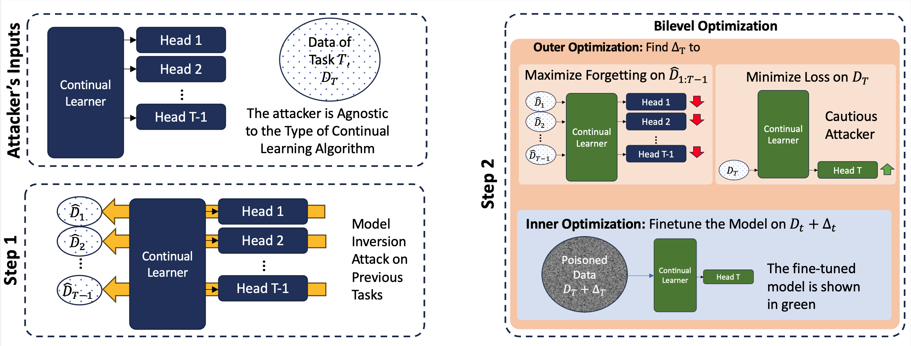

# Brainwash
BrainWash: A Poisoning Attack to Forget in Continual Learning


This is the official repository of the CVPR 2024 paper, **"BrainWash: A Poisoning Attack to Forget in Continual Learning"**. [\<ArXiv Version\>](https://arxiv.org/pdf/2311.11995.pdf)

<p align="center">
    
</p>


BrainWash has four stages: 

1. Training a Continual Learner for N-1 tasks (The final task will be attacked). 
2. Performing the model inversion attack to obtain approximate samples of the previous tasks.
3. Training the BrainWash noise. 
4. Evaluating the noise performance.

**The datasets, checkpoints, and inverted samples, used for producing the tables are here: https://huggingface.co/datasets/mintlabvandy/BrainWash-CVPR24/tree/main**

### Training the Continual Learner
This repository contains supports 4 different regularization-based CL methods: EWC, Rwalk, MAS, and AFEC-EWC. 

The following command runs the afec_ewc for 9 tasks of split CIFAR-100:

```
 CUDA_VISIBLE_DEVICES=0 python main_baselines.py --experiment split_cifar100 --approach afec_ewc  --lasttask 9 --tasknum 10 --nepochs 20 --batch-size 16 --lamb 500000 --lamb_emp 100 --clip 100.  --lr 0.01
```

nepochs and batch-size remain the same for Rwalk, MAS, and AFEC. 

Only afec_ewc has an additional hyperparameter called "lamb_emp" for further finetuning the consolidation step. Other methods have the "lamb" as their main stability-plasticity hyperparameter. The higher the "lamb" the more stringent the model becomes (more stable, less plastic). 

The following is the "lamb" value per method:

| Method    | EWC |Rwalk |MAS |AFEC_EWC |
|  -------- | -- |-- |-- |-- |
| Lamb  | 5e5 | 1. | 10 | lamb=5e5, lamb_emp=100

Note that "task_num" is the total number of tasks, however, the training stops at "lasttask" as the final task which is the 10th task in split cifar-100 should get poisoned. 

The final result of the training is a .pkl file that contains the victim's checkpoint along with metadata of the training like the name of the dataset. Please note that although this information is saved, the attacker does not use any additional information other than the model's weight. The saved information is only for conveniently performing further evaluations after the noise is trained. 


### Model Inversion Attack
This is the second stage of the poisoning. Now that the attacker has white-box access to the continual learner, an inversion attack is performed to approximate the previous tasks' data. These inverted samples are necessary for solving the Eq. 4 / Eq. 5. 

```
python main_inv.py --pretrained_model_add=<pkl_file> --num_samples=128 --save_dir=<output dir> --task_lst=0,1,2,3,4,5,6,7,8 --save_every=1000 --batch_reg --init_acc --n_iters=10000
```

the inverted sample will be saved at "save_dir". 

**The datasets, checkpoints, and the inverted samples, used for producing the tables are here: https://huggingface.co/datasets/mintlabvandy/BrainWash-CVPR24/tree/main**

### Training the BrainWash
Reckless mode:
```
CUDA_VISIBLE_DEVICES=0 python main_brainwash.py --extra_desc=reckless_test --pretrained_model_add=<pkl_file> --mode='reckless' --target_task_for_eval=0 --delta=0.3 --seed=0 --eval_every=10 --distill_folder=<inversion_folder> --init_acc --noise_norm=inf --cont_learner_lr=0.001 --n_epochs=5000 --save_every=100 
```

Cautious mode:
```
CUDA_VISIBLE_DEVICES=0 python main_brainwash.py --extra_desc=cautious_test --pretrained_model_add=<pkl_file> --mode='cautious' --target_task_for_eval=0 --delta=0.3 --seed=0 --eval_every=10 --distill_folder=<inversion_folder> --init_acc --noise_norm=inf --cont_learner_lr=0.001 --n_epochs=5000 --save_every=100 --w_cur=1
```

The result of the noise training is yet another .pkl file that contains the trained noise as well as the additional attack details. 
The noise is accessible via the 'latese_noise' key. 

### Evaluation
After the BrainWash is trained it is time to evaluate the noise performance, i.e., resuming the continual learner training with noise:

```
CUDA_VISIBLE_DEVICES=0 python main_baselines.py --experiment split_mini_imagenet --approach afec_ewc --lasttask 9 --tasknum 10 --nepochs 20 --batch-size 16 --lr 0.01 --clip 100. --lamb 500000 --lamb_emp 100  --checkpoint <noise_pkl_file>  --init_acc --addnoise
```

The pkl file from the previous step should be passed via the "checkpoint" parameter. 
Apart from logging the accuracy in the terminal, the evaluation code also outputs the matrix in a .npy file, starting with "acc_mat_". 